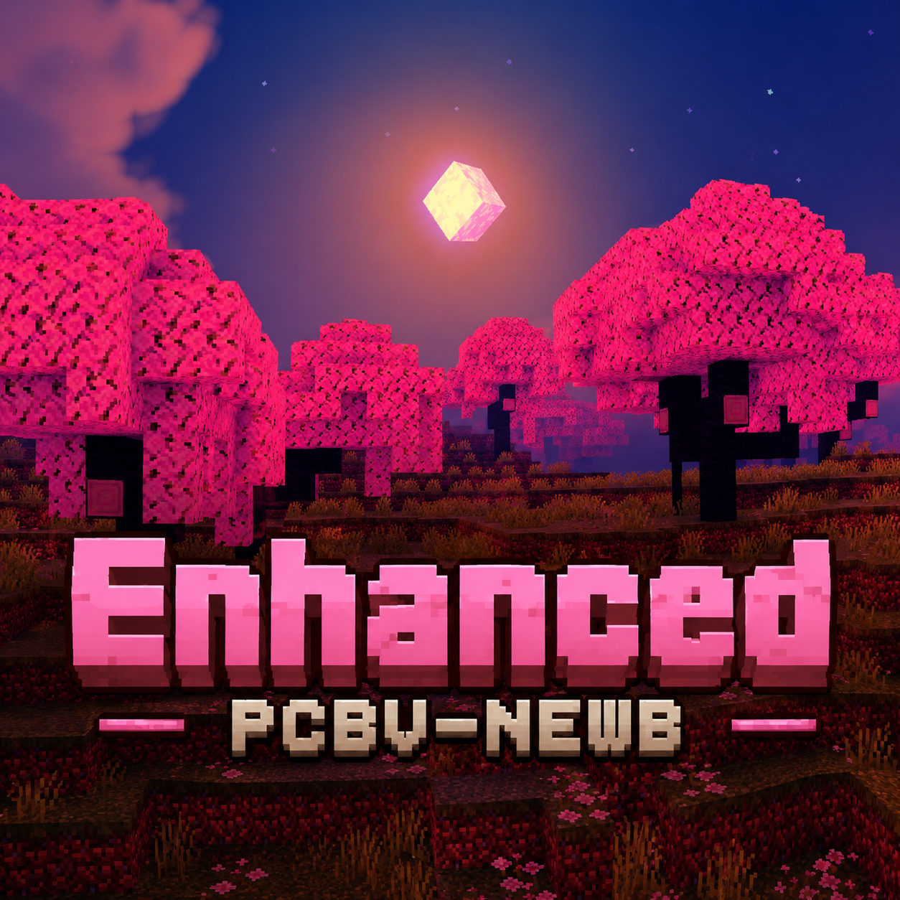

PCBV-NEWB

  

Shader resource pack Minecraft Bedrock Edition berbasis Newb Shader.

Deskripsi

PCBV-NEWB merupakan modifikasi dari Newb Shader dengan beberapa penyesuaian visual dan konfigurasi tambahan.

Instalasi

1. Download repository atau release.
2. Import ke Minecraft Bedrock Edition.
3. Aktifkan pada Resource Packs.

Credits

- Newb Shader
- PCBV-NEWB Project

Repository

https://github.com/Gledi01/pcbv-newb-mcpe
